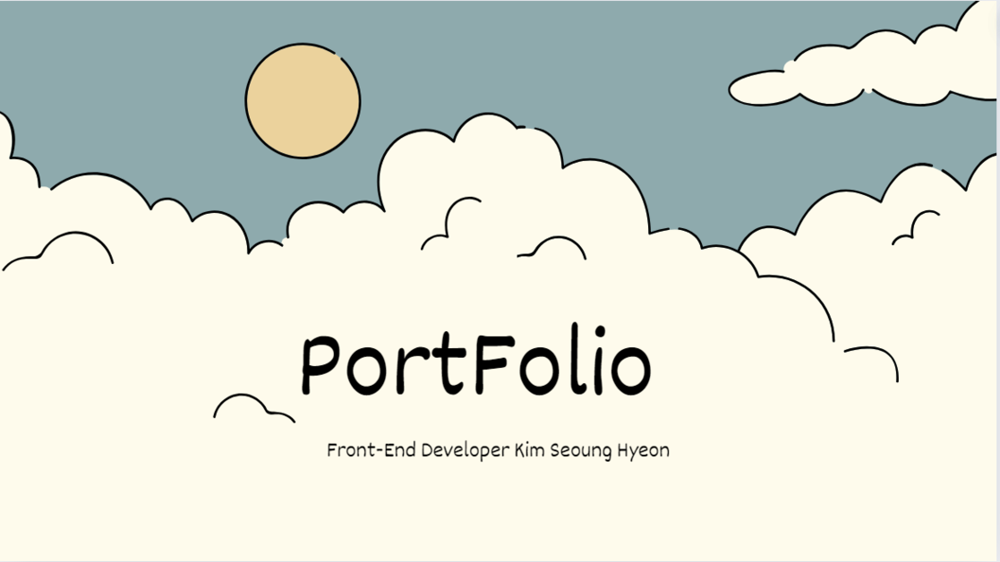
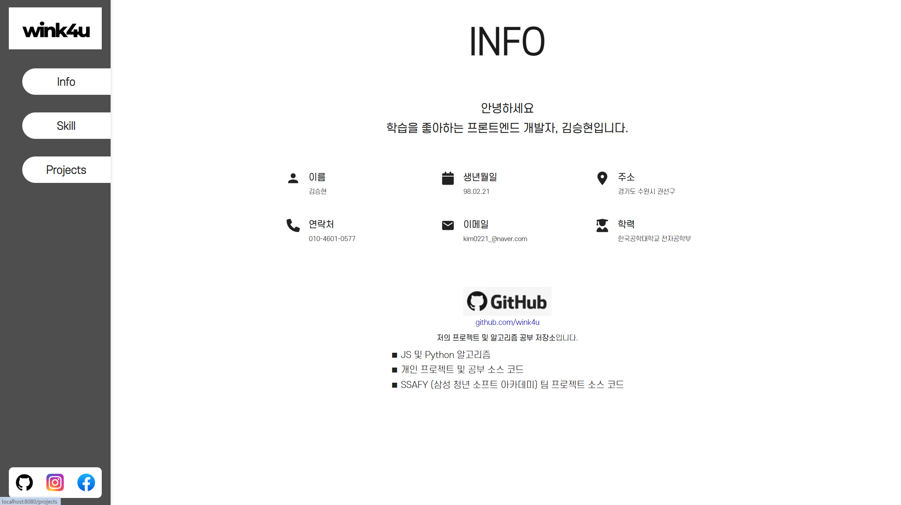
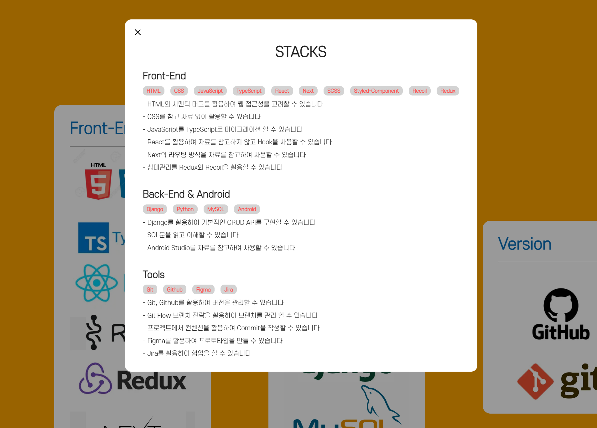
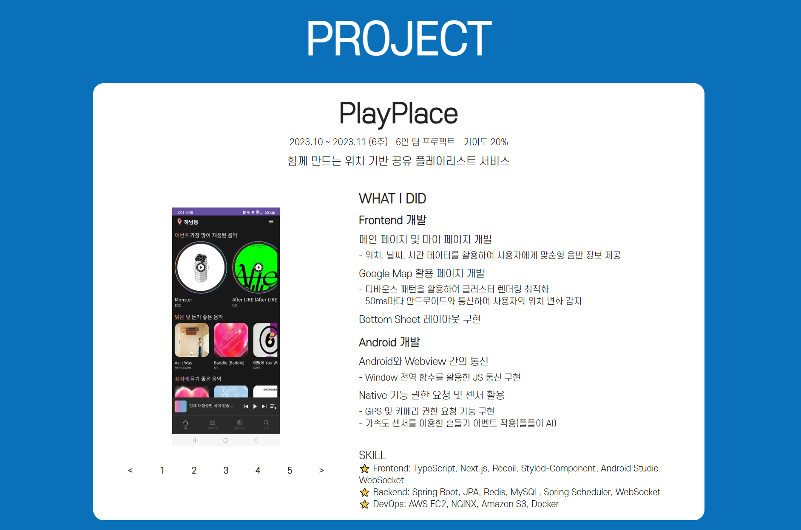

# 🔍 Wink4u's PortFolio

 

### 프론트엔드 개발자 지망생 김승현의 웹 포트폴리오

 PDF가 아닌 Web으로 포트폴리오를 만들어 볼까?
 Next.js의 App Router를 활용해보면 어떨까?

 프론트엔드 개발자로 성장하기 위해 떠올렸던 질문의 해답을 헤쳐나가기 위한 프로젝트입니다.

https://wink4u.site

## 🌱 구현화면

### 메인화면

  인적사항 및 저의 간단 Github내역을 게시했습니다. 반응형 웹 페이지로 화면의 확대 축소에 따른 변화가 있습니다.

## Skill화면

  제가 활용하였던 Skill들을 나열했으며, Modal을 인터셉팅 라우팅을 활용하여 새롭게 해석했습니다.

## Project화면

  진행했던 프로젝트의 내역과 Readme 버튼을 활용해 세부내용을 확인할 수 있습니다.

## 🔥 사용 기술

<b> FrontEnd | </b> `TypeScript`, `Next`, `ESLint`

<b> DevOps | </b> `AWS EC2`, `Nginx`

<b>Tool | </b> `Git`, `Figma`